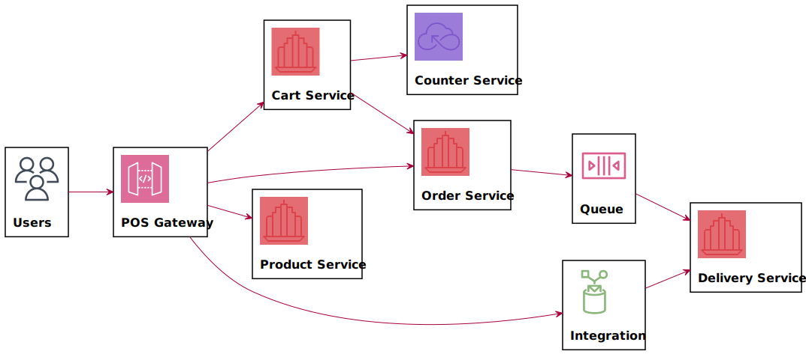

# aw08

使用 spring integration 实现的 gateway.

## 实现注意

注意Spring/SpringBoot/SpringIntegration之间的版本兼容问题.

注意println返回的是空.

## 讨论

Spring Integration 可以用作Gateway实现，但似乎是没有必要的。

它更适合处理更复杂的集成逻辑，对数据流进行过滤、变换、拆分、整合、路由，配合常用的协议与基础应用将一个需要多个项目共同运作的大项目的数据流拓扑构建起来。

***

Run the project with `mvn spring-boot:run` and send request to `http://localhost:8080/check`. You should see an reponses in json format like the following.

```json
{
    "icon_url": "https://assets.chucknorris.host/img/avatar/chuck-norris.png",
    "id": "kswv7NIaTCaIIErlBzODaA",
    "url": "https://api.chucknorris.io/jokes/kswv7NIaTCaIIErlBzODaA",
    "value": "Chuck Norris's shadow weighs 250 pounds and can kick your ass ."
}
```

Try to understand the provided code which demonstrates spring integration between a spring boot application with an externel http service (https://api.chucknorris.io/jokes/random).

Please implement delivery as an standalone service (just like the random joke service). Refer the sample code to integrate your Micropos system with delivery service so that user can check delivery status on Miropos which actually forwards user request to delivery service on demand.



Consider the advantage by doing so and write it down in your readme file.